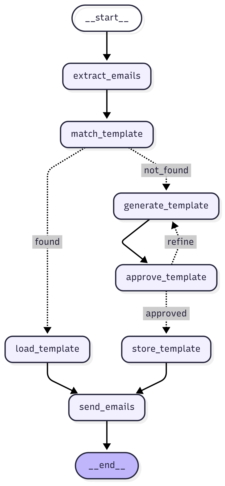

# Email Agent Automation System

## Overview

The Email Agent is an automated system designed to streamline the creation and delivery of customized emails and securely handle password reset workflows. It leverages language models to dynamically generate or match email templates, routes them through an approval pipeline, stores them for reuse, and dispatches them to the appropriate recipients.

It also integrates a secure password reset mechanism using FastAPI and PostgreSQL, complete with token-based verification and email notification through SendGrid.

This system is well-suited for organizations looking to automate internal communications or manage sensitive user actions like password resets in a controlled, extensible way.

---

## Features

### Email Automation Workflow
- **Intent Parsing**: Interprets user queries to extract relevant actions and targets.
- **Template Matching**: Uses a language model to find existing templates based on intent.
- **Dynamic Template Generation**: Creates new HTML-based email templates if none match.
- **Approval and Feedback Loop**: Refines generated templates based on approval decisions.
- **Persistent Storage**: Stores templates in a PostgreSQL database for future reuse.
- **Email Delivery**: Sends the final approved email to all matched recipients via SendGrid.

### Password Reset Module
- **Secure Token Generation**: Issues one-time password reset tokens valid for 30 minutes.
- **Email Notifications**: Sends reset links to the user’s registered email.
- **Token Verification and Expiry Checks**: Validates and processes token-based password resets using FastAPI endpoints.
- **Backend Built with FastAPI**: RESTful architecture allows easy frontend integration.

---

## System Architecture

> A visual representation of the email agent workflow can be placed here.

```text
[Insert your diagram here]

```

---
##  Project Structure

```sh
└── email-agent/
    ├── README.md
    └── app
        ├── agent
        │   ├── __pycache__
        │   │   ├── agent.cpython-311.pyc
        │   │   └── sql_agent.cpython-311.pyc
        │   ├── agent.py
        │   ├── images
        │   │   └── Editor _ Mermaid Chart-2025-06-24-005253.png
        │   ├── nodes
        │   │   ├── __pycache__
        │   │   │   ├── approve_template.cpython-311.pyc
        │   │   │   ├── extract_email.cpython-311.pyc
        │   │   │   ├── generate_template.cpython-311.pyc
        │   │   │   ├── load_template.cpython-311.pyc
        │   │   │   ├── match_template.cpython-311.pyc
        │   │   │   ├── send_emails.cpython-311.pyc
        │   │   │   ├── shared.cpython-311.pyc
        │   │   │   └── store_template.cpython-311.pyc
        │   │   ├── approve_template.py
        │   │   ├── extract_email.py
        │   │   ├── generate_template.py
        │   │   ├── load_template.py
        │   │   ├── match_template.py
        │   │   ├── send_emails.py
        │   │   ├── shared.py
        │   │   └── store_template.py
        │   └── sql_agent.py
        ├── api
        │   ├── __pycache__
        │   │   └── endpoints.cpython-311.pyc
        │   └── endpoints.py
        ├── db
        │   ├── __pycache__
        │   │   └── createdb.cpython-311.pyc
        │   └── createdb.py
        └── frontend
            ├── chatbot.py
            ├── request_link.py
            └── reset_password.py
```

---

## Installation

1. **Clone the repository**
```bash
git clone https://github.com/your-username/email-agent.git
cd email-agent
```

2. **Set up a virtual environment**
```bash
python3 -m venv venv
source venv/bin/activate
```

3. **Install dependencies**
```bash
pip install -r requirements.txt
```

4. **Configure environment variables**

Create a `.env` file in the root directory with the following keys:
```env
POSTGRES_URI=your_postgres_connection_string
SENDGRID_API_KEY=your_sendgrid_api_key
FROM_EMAIL=your_verified_sendgrid_email
FRONTEND_URL=http://localhost:8502
GEMINI_API_KEY=your_gemini_api_key
```

5. **Initialize the database**
```bash
python db/createdb.py
```

---

## Running the Project

### Run the Email Agent
```bash
python agent/agent.py
```

### Run the FastAPI Backend
```bash
uvicorn api.endpoints:app --reload
```

---

## API Endpoints

| Method | Endpoint                   | Description                        |
|--------|----------------------------|------------------------------------|
| POST   | `/request-password-reset`  | Sends password reset link to email |
| POST   | `/reset-password`          | Verifies token and updates password |

---

## Dependencies

See `requirements.txt` for the complete list. Key libraries include:
- `fastapi` – API framework for the password reset backend
- `langgraph` – Workflow engine for the email agent logic
- `langchain-google-genai` – Integrates Google’s Gemini model for LLM-based actions
- `psycopg2` – PostgreSQL driver
- `python-dotenv` – Loads environment variables from `.env` files
- `sendgrid` – Email delivery via SendGrid

---

## Contributing

Contributions are welcome. To contribute:

1. Fork the repository
2. Create a new feature branch
3. Commit your changes
4. Submit a pull request with a description of your update

---

## License

This project is licensed under the [MIT License](LICENSE).

---
